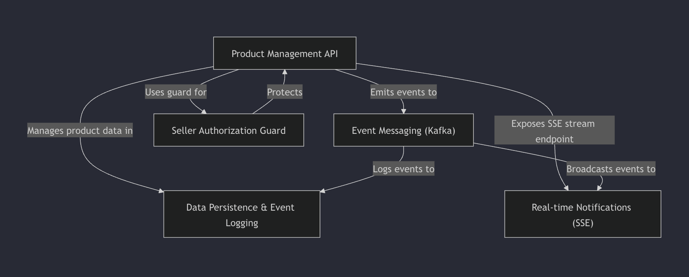

# Event-Driven-Product-Management-System-API

This project is an **Event-Driven Product Management System API** designed to help sellers easily _manage their product inventory_. It allows sellers to create, update, list, and delete products through a primary set of API endpoints. The system leverages **Kafka** for _asynchronous event communication_ (like new products or low stock warnings) and delivers _real-time updates_ directly to sellers via **Server-Sent Events (SSE)**. All product data is _persisted_ in a database, and critical actions are _logged_ for auditing, while access to product management features is secured by a **seller authorization guard**.

## Visual Overview



## Project setup

```bash
docker compose up -d

export AWS_ACCESS_KEY_ID=dummy
export AWS_SECRET_ACCESS_KEY=dummy
export AWS_DEFAULT_REGION=us-east-1

aws dynamodb create-table \
  --table-name EventLog \
  --attribute-definitions AttributeName=PK,AttributeType=S AttributeName=SK,AttributeType=S \
  --key-schema AttributeName=PK,KeyType=HASH AttributeName=SK,KeyType=RANGE \
  --billing-mode PAY_PER_REQUEST \
  --endpoint-url http://localhost:8000

pnpm install
npx prisma migrate dev
pnpm start:dev
```
